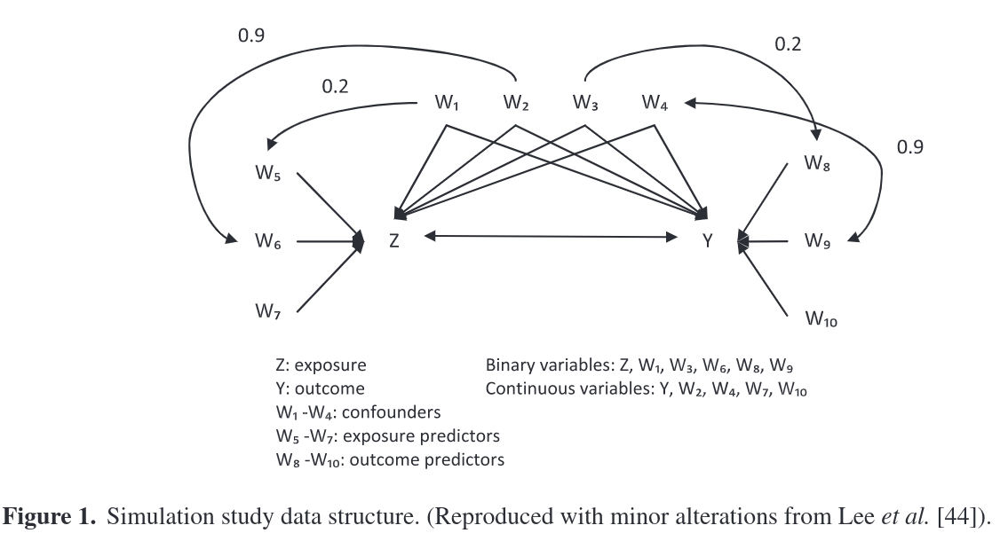

```{r setup, include = FALSE}
knitr::opts_chunk$set(echo = TRUE)
library(ggplot2)
library(plotly)
library(shiny)
```

# Wyss et al, 2015 {.tabset .tabset-fade .tabset-pills}

---

**TITLE:** _Matching on the disease risk score in comparative effectiveness research of new treatments_

**LINK:** [here](https://onlinelibrary.wiley.com/doi/full/10.1002/pds.3810)

---

## Introduction

The DRS has typically been estimated in one of two ways. The first is to fit a
regression model within the cohort of individuals receiving the comparator
treatment and then extrapolate this model to predict disease risk for the full
cohort. The second is to fit a regression model within the full cohort as a
function of baseline covariates and treatment and then estimate the disease risk
for each individual after setting treatment status tozero

Small misspecifications in the full-cohort DRS model can introduce bias by
resulting in estimated scores that are non-ancillary or carry information about
the treatment
effect. [Hansen](https://www.jstor.org/stable/20441477?seq=1#metadata_info_tab_contents)
has suggested fitting only to the controls as the full-cohort approach requires
accurate modeling of the risk-treatment relationship.

## Simulation

Covariates $X_1,\dots,X_{96}\sim B(0.5)$, $X_{97},\dots,X_{100}\sim N(0, 1)$,
treatment $t_x$ and binary outcome $Y$.

$$
\text{logit}(P(t_x=1 | X_1, \dots X_{100})) = \alpha_0 + \alpha_1X_1+\cdots +\alpha_{100}X_{100}
$$

$$
\text{logit}(P(Y=1 | X_1, \dots X_{100})) = \beta_0 + \beta_1X_1+\cdots +\beta_{100}X_{100} + \beta_{t_x}t_x + \beta_{\text{int}} X_1t_x
$$

DRS were estimated in a historical population of controls ,using a correctly
specified model. PS were simulated in the original dataset, again using a
correctly specified model. $\alpha_0$ and $\beta_0$ were such that 30\%
treatment prevalence and outcome rate were achieved.

A total of 8 scenarios based on settings for constant treatment effect, HTE,
effect sizes (both positive and negative), sample sizes, caliper distance when
matching. HTE was introduced by modifying $\beta_{\text{int}}$.

## Discussion
PS methods require that there be no combination of covariate values that result
in individuals receiving treatment or control with certainty (i.e., positivity
assumption). Adjustment on the DRS requires a weaker condition that there be no
levels of disease risk at which treatment or control is received with
certainty. This results in more patients getting matched.

Balance on the DRS does not imply banace on the PS. DRS balances covariates
across outcomes, not across treatments.


# Leacy and Stuart, 2012 {.tabset .tabset-fade .tabset-pills}

---

**TITLE:** _On the joint use of propensity and prognostic scores in estimation
of the average treatment effect on the treated: a simulation study_

**SHORT:** _Simulation study comparing
(1) regression conditioning on covariates; 
(2) subclassification on PS using 5 strata;
(3) full matching on PS; 
(4) subclassification on the DRS using 5 strata;
(5) full matching on DRS;
(6) subclassification on a $5\times5$ grid of PS-DRS;
(7) full matching on Mahalanobis distance combining PS-DRS;
(8) full matching on DRS within PS calipers; 
The combination full matching methods were superior._

**LINK:** [here](https://onlinelibrary.wiley.com/doi/full/10.1002/sim.6030)

---

## Introduction
PS and DRS are complimentary approaches. Matching on the propensity score PS
tends to produce balance in, and consequently removes bias due to, covariates
highly predictive of treatment assignment. Matching on the DRS tends to produce
balance in covariates highly predictive of the outcome.

[Brookhart et al,
2006](https://academic.oup.com/aje/article/163/12/1149/97130?login=true) have
shown that including in the PS variables related to the outcome and not related
to exposure decreases the variance of the effect estimate, without increasing
bias. On the other hand, including variables solely associated with exposure but
not with the outcome will increase variance without decreasing the bias of the
estimate.

## Simulation
The simulation setup was similar to [Setguchi et al, 2008
](https://onlinelibrary.wiley.com/doi/10.1002/pds.1555) and [Lee et al, 2010
](https://onlinelibrary.wiley.com/doi/10.1002/sim.3782)



Both correctly specified and misspecified PS and DRS models were
considered. Misspecified models for DRS and PS consisted of main effect terms
for all 10 covariates.  DRS models were fitted in the control group only. All
models used standard logistic regression.

## Discussion
Full matching on a Mahalanobis distance combining the estimated PS and DRS
represents the most promising approach by which these scores may be combined to
estimate the average treatment effect on the treated.

Their approach does not compromize the separation design and outcome analysis,
as only the outcomes of a a single treatment group are used in the estimation of
DRS. Separation can be further protected by fitting the DRS model on a separate
sample of controls.

The results of the present simulation study indicate that subclassification on
both the propensity and prognostic scores can be associated with significant
bias reduction and precision gain compared with subclassification on the
propensity or prognostic score alone. The considered methods exhibited superior
performance to corresponding propensity score methods when one or both scores
were incorrectly specified.
